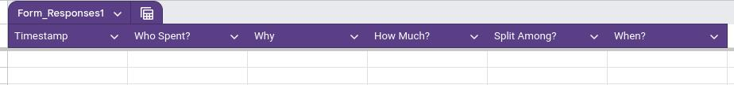

# Shared Expenses

This project is a Google Apps Script for managing shared expenses. It processes raw expense data, splits the expenses among participants, calculates the contributions, and provides transaction recommendations to settle debts.

## Table of Contents

- Installation
- GoogleSheet Requirements

## Installation

1. Clone the repository to your local machine.
2. Install [clasp](https://github.com/google/clasp) globally using npm:
   ```sh
   npm install -g @google/clasp
   ```
3. Log in to your Google account using clasp:
   ```sh
   clasp login
   ```
4. Open the Google Sheets document where you want to use the script. (More about the sheet's requirement below)
5. Open the script editor by navigating to `Extensions > Apps Script`.
6. Save the script project and copy the script ID from settings.
7. Create a new folder with a name of your choice and navigate to it.
8. Run the following command to clone the script project to your local machine:
   ```sh
   clasp clone <SCRIPT_ID>
   ```
9. Copy the contents of the files from this repository into the newly created folder.
  - Do not replace the `.clasp.json` and `appsscript.json` files in your project folder.
10. Run the following command to push the script to your app script workspace:
   ```sh
   clasp push
   ```
11. Open [Google App Script](https://script.google.com/) and navigate to the project.
12. Go to triggers and create a new trigger for the `Main` function to run on sheet change and Save.
13. Add another trigger for the `Main` function to run on form submit and Save.


## GoogleSheet Requirements

1. Create a Form for the sheet with these fields:
    - Note that the title of questions are important.
    - `Who Spent?` must be a dropdown question with the names of the participants.
    - `Split Among?` must be a multiple-choice question with the names of the participants, the name must be the same as the names in the `Who Spent?` question.
    
      

2. The Sheet for the form response must be renamed to `Raw`.
3. The Sheet must look like this:
  
    


## What Will the Script Do?
- The script will process the raw data from the `Raw` sheet and group the expenses by month.
- Then the script will calculate the contributions of each participant for each month.
- Finally, the script will provide transaction recommendations to settle debts.

## License

This project is licensed under the MIT License. See the LICENSE file for details.